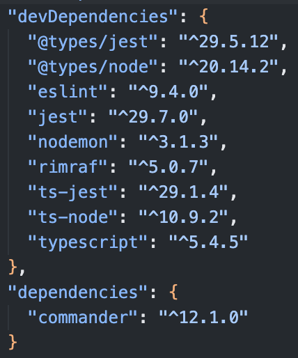

# Path following algorithm in ASCII Map

Problem description [here](https://github.com/softwaresauna/code-challenge)

## Solution

Program takes an ASCII Map as an input and it outputs collected letters, path as characters or an error if map is invalid. Program starts with a letter `@` and it ends with a letter `x`. Valid characters are all uppercase letters from `A` to `Z`. Turns could be letters or letter `+`

- Input: ASCII Map
- Output: 
  - Collected letters
  - Path as characters
  OR
  - Error if map is invalid

## Installation
`npm install`

Make sure you have same dependencies / devDependencies versions:

## Run an application
- Run in development mode: `npm run dev`
- Run valid map in production mode: `npm run start -- -f examples/map6.txt`
- Run invalid map in production mode: `npm run start -- -f examples/invalid-map3.txt`

## Run tests
`npm run test`

All possible test cases covered

Proof:

## Author
- Name: Aleksandar Cvjetan
- GitHub: crypt096
- Contact info: acvjetan@gmail.com